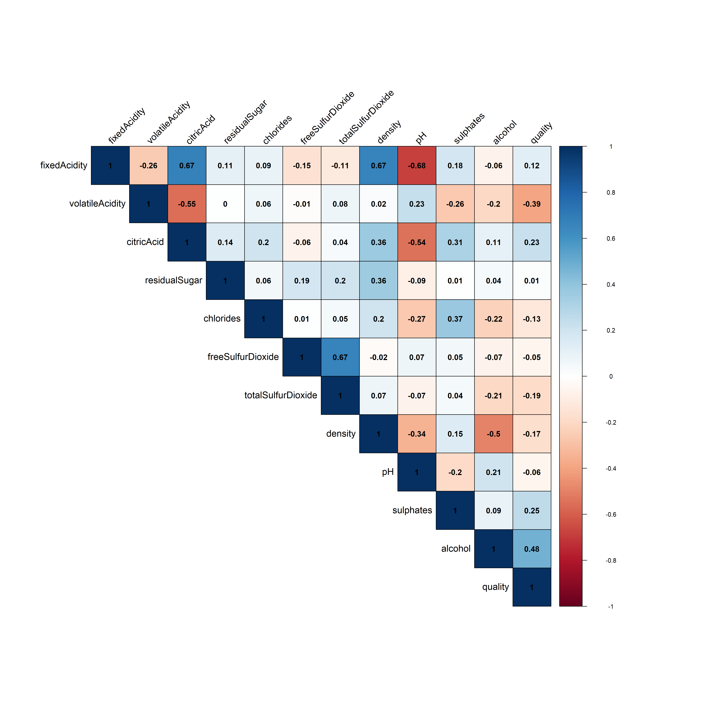
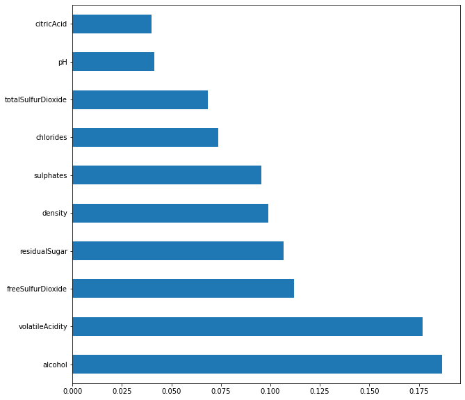
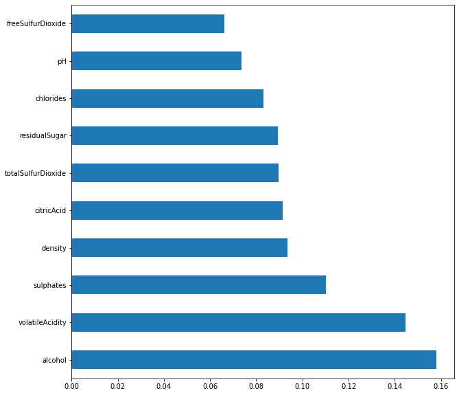
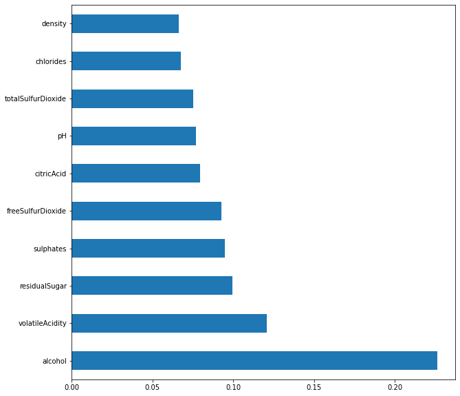
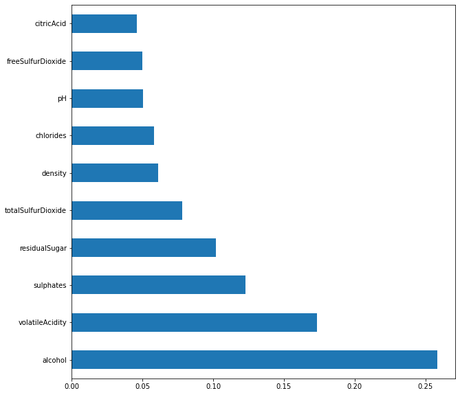

```{r setup, include=FALSE}
## Global options
knitr::opts_chunk$set(echo = TRUE)
```
## About
*This dataset is related to red variant of the Portuguese "Vinho Verde" wine. Due to privacy and logistic issues, only physicochemical (inputs) and sensory (the output) variables are available (e.g. there is no data about grape types, wine brand, wine selling price, etc.). The classes are ordered and not balanced (e.g. there are many more normal wines than excellent or poor ones).*  

**Input variables** (based on physicochemical tests):  
1. fixed acidity *g(tartaric acid)/dm*    
2. volatile acidity *g(acetic acid)/dm*   
3. citric acid *g/dm*   
4. residual sugar *g/dm*  
5. chlorides *g(sodium chloride)/dm*    
6. free sulfur dioxide *mg/dm*  
7. total sulfur dioxide *mg/dm*    
8. density *g/dm*      
9. pH  
10. sulphates *g(potassium sulphate)/dm*  
11. alcohol *% vol*      

**Output variable** (based on sensory data):   
12. quality (score between 0 and 10)  

**Analysis question/approach**  
Classify wine quality from physicochemical properties  
Build a model to predict wine quality (regression)  
Identify attributes differentiating low vs high quality wine  

1. MR (multiple regression)  
2. NN (neural network)  
3. SVM  (support vector machine learning)  
4. random forest classifier  
5. imbalanced sklearn  

need to preserve order  
address imbalance  


## Initialize package libraries

```{r, message=FALSE, warning=FALSE}
#install.packages("usethis")
#install.packages("rmdformats")
library(usethis)
library(magrittr)
library(highcharter)
library(explore)
library(dplyr)
library(DataExplorer)
library(skimr)
library(rmdformats)
library(readr)
library(DT)
library(ggplot2)
library(pastecs)
library(corrplot)

# Connect RStudio to Git client
# usethis::create_from_github(
#  "https://github.com/dezzygc/WineData.git", destdir = "./wine_repo")
```

```{r import dataset, results=TRUE, message=FALSE}
# Import dataset
wine_df <- read_csv("red_wine_data.csv")
#as_tibble(wine_df)
datatable(wine_df)
```

## Data diagnostics  
1. Check NA values  
2. Check highly correlated feature variables  
4. Assess balance and distribution  


```{r}
# wine_df %>% explore()
# wine_df %>% report(output_file = "report.html", output_dir = getwd())
```


```{r warning=FALSE}
# explore structure of dataframe, compute summary descriptives and examine quantiles/distribution
skim(wine_df)

```

### Check for Missing Values

```{r eval=FALSE, message=FALSE, warning=FALSE, include=FALSE}

DataExplorer::create_report(wine_df)

```


```{r eval=FALSE, message=FALSE, warning=FALSE, include=FALSE}
wine_df %>% explore_all(target = quality)
#wine_df %>% explore_all()

```

No missing values for all variables.    

  
```{r histogram quality}

ggplot(wine_df, aes(quality)) +
  geom_histogram(color = "#000000", fill = "#0099F8", bins = 8) +
  labs(
    title = "Histogram of Wine Quality Rating",
    caption = "Source: Wine dataset",
    x = "Quality Rating",
    y = "Count") +
  theme_classic() +
theme(
  plot.title = element_text(color = "#0099F8", size = 14, face = "bold"),
    plot.subtitle = element_text(size = 10, face = "bold"),
    plot.caption = element_text(face = "italic")
)
```

Calculate the bin width by dividing the specification tolerance or range (USL-LSL or Max-Min value) by the # of bins (and rounding up)


```{r}
boxplot(wine_df$quality, horizontal=TRUE, col=rgb(0.8,0.8,0,0.5), main="Wine Quality")

```


```{r echo=FALSE, warning=FALSE}
quality_df <- wine_df$quality

table_count <- table(quality_df) # frequency table
print("Frequency table")
print(table_count)  

cumsum <- cumsum(table_count) # cumulative frequency table
print("Cumulative frequency table")
print(cumsum)

```

```{r}
ratings.vec <- as.vector(t(table_count)) # store rating frequencies
qual_rating<- c(rownames(table_count)) # store rating values
```

```{r item chart for quality ratings, echo=FALSE, message=FALSE, warning=FALSE}
df <- data.frame(
  stringsAsFactors = FALSE,
  name = c(qual_rating),
  count = c(ratings.vec),
  col = c("#BE3075", "#EB001F", "#64A12D", "#FFED00",
          "#000000", "#008AC5"
  ),
  abbrv = c("3", "4", "5", "6", "7", "8")
)

hchart(
  df,
  "item",
  hcaes(
    name = qual_rating,
    y = ratings.vec,
    label = abbrv,
    color = col
  ),
  name = "Rating",
  showInLegend = TRUE,
  size = "150%",
  center = list("50%", "75%"),
  startAngle = -100,
  endAngle  = 100
) %>%
  hc_title(text = "Item Chart - Wine Quality Rating") %>%
  hc_legend(labelFormat = '{name} <span style="opacity: 0.4">{y}</span>')
```
### Check distribution of target and feature variables

```{r echo=FALSE, results='asis', warning=FALSE}
#Check skew, kurtosis
statdesc <- round(stat.desc(wine_df, basic=F, desc=F, norm=TRUE, p=0.95), 3)
library(knitr)
kable(statdesc)
```
### Check highly correlated features


```{r message=FALSE, warning=FALSE, include=FALSE}
M <- cor(wine_df)
testRes <- cor.mtest(wine_df, conf.level = 0.95)
#png(file="corr.png", res=300, width=4500, height=4500)
corplt <- corrplot(M, method="color", type='upper', order='original', sig.level =.05, addCoef.col=1, number.cex=1, tl.cex= 1.2, tl.col="black", outline=T, tl.srt=45, insig="blank", cl.ratio=.2, mar=c(1,1,1,1))

```

Fixed acidity is highly correlated with several feature variables. Removed prior to classifier selection.  

## Data preparation

### Binning Wine Quality Rating  

Recoding quality to reduce number of bins (with equal widths but unequal frequencies). Ratings 3-4 = low quality, 5-6 =  quality, 7-8 = high quality.  

```{r}
wine_df$quality2 <- recode(wine_df$quality, `3` = 1, `4` = 1, `5` = 2, `6` = 2, `7`= 3, `8`= 3)

wine_df$quality_ordered <- factor(wine_df$quality2, ordered = TRUE, 
                                levels = c("1", "2", "3"))
table(wine_df$quality2)
```


```{r item chart for binned ratings, echo=FALSE, message=FALSE, warning=FALSE}
# reassessing distribution
df2 <- data.frame(
  stringsAsFactors = FALSE,
  name = c("low","norm","high"),
  count = c(63,1319,217),
  col = c("#BE3075", "#EB001F", "#64A12D"
  ),
  abbrv = c("1", "2", "3"))


hchart(
  df2,
  "item",
  hcaes(
    name = name,
    y = count,
    label = abbrv,
    color = col
  ),
  name = "Rating",
  showInLegend = TRUE,
  size = "150%",
  center = list("50%", "75%"),
  startAngle = -100,
  endAngle  = 100
) %>%
  hc_title(text = "Item Chart - Wine Quality Rating") %>%
  hc_legend(labelFormat = '{name} <span style="opacity: 0.4">{y}</span>')
```
### Addressing class imbalance

1. Undersampling  
2. Oversampling  
3. Algorithmic approaches  

Imbalanced data can lead to overfitting and underfitting issues - the *Accuracy paradox*. The classification analysis that proceeds highlights the impact of class imbalance on accuracy estimates.   

# Fitting a Classifier

## Export csv for modelling in Jupyter
```{r}

write.csv(wine_df, "./ready_wine.csv", row.names=FALSE)

```

## Classifier selection in Python with SciKit.learn.    

Please see jupyter notebook ('wine.ipynb') for classifier selection analyses ensemble, boosting algorithms), executable through google Collaboratory. A Jupyter notebook is accessible through the github repo (https://github.com/dezzygc/WineData.git).  

The following classifiers were examined:     
1. **Decision tree classifier**  
2. **Random Forest classifier**    
3. **Gradient Boosting**  
4. **XG Boosting**  
5. **Support Vector Machine (SVM)** - weighted and unweighted  

### Step 1 - Normalize feature variables

### Step 2 - Split data into test and training sets  

### Step 3 - Fit classifier and report classification metrics  
Metrics include *precision, recall, f1-score, support* and *accuracy*. The metrics focused upon here are defined below.  

**Precision**: the ability of the classifier to avoid labeling a negative sample as positive (i.e false positive). This is calculated as true positives/(true positives + false positives).  

**Recall**: ability of the classifier to identify all positive samples in each class. This is calculated as true positives/(true positives + false negatives).  

**F1-Score**: the weighted harmonic mean of precision and recall. A good approximation of accuracy for imbalanced datasets (consider the Precision-Recall Trade-Off) by accounting for type I and type II errors. It gives equal weight to both recall and precision, i.e. identification of all positive cases (recall) versus identification of only positive case (precision). If precision and recall are both high, the F1 score will also be high (a score close to 1.0).  Similarly, the model will obtain a medium F1 score if either Precision or Recall is low and the other is high.  


**Accuracy**: includes two metric options. The macro average is an average of the total true positives, false neagtives and false positives. The weighted-average accuracy returns the average accuracy per class, making it suitable for mutli-classification problems.  

## Classifier Summary  

Please see Jupyter notebook.  


### Model 1 (decision tree) feature importance  

  


```{r}
wine_df %>% explain_tree(target=quality)

```


### Random Forest feature importance  

  
### XGB feature importance  
  


### Gradient boost classifier feature importance  


  


